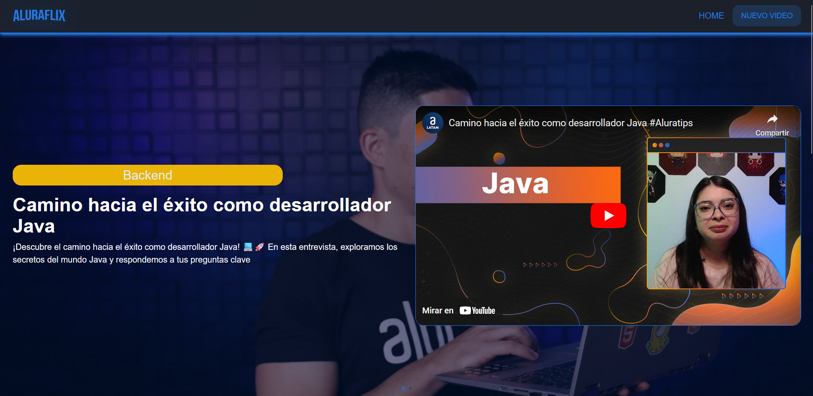
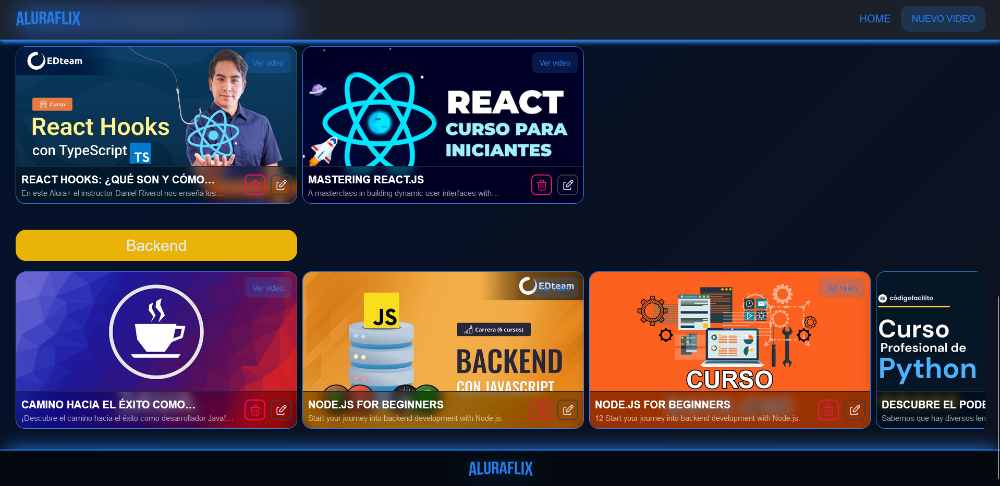
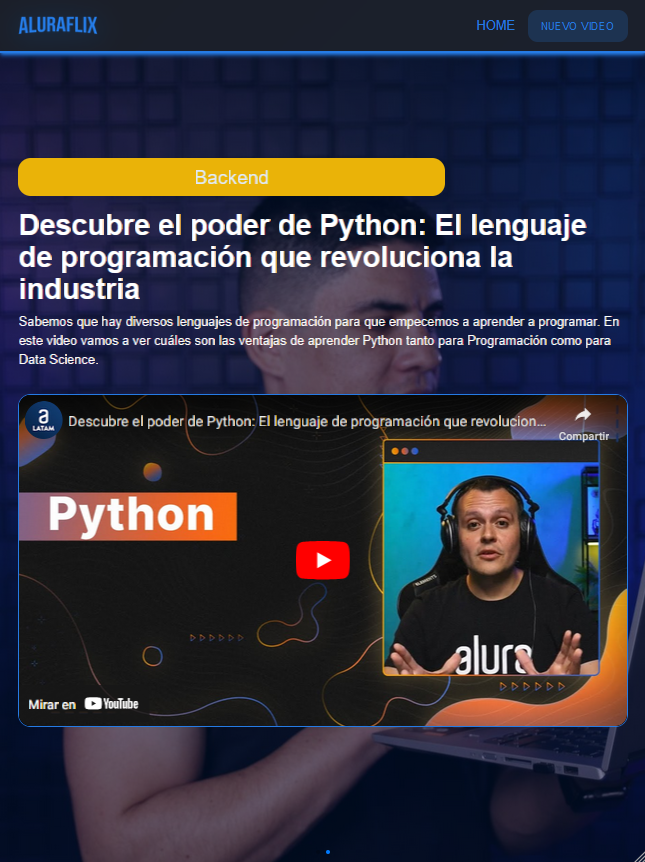
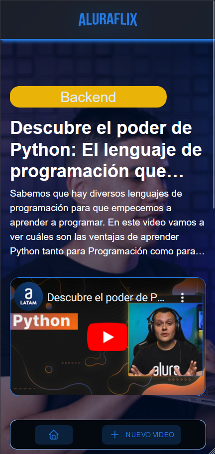

# AluraFlix Challenge - Oracle One Education & Alura Latam

AluraFlix es una plataforma diseñada para gestionar vídeos, con funcionalidades como listar, registrar, actualizar y eliminar videos, implementando React con JavaScript. Este proyecto permite aplicar y mejorar habilidades en React, incluyendo componentización, uso de hooks, consumo de API, rutas, entre otros conceptos avanzados.

## Tabla de contenidos

- [Visión general](#visión-general)
  - [Descripción](#descripción)
  - [Capturas de pantalla](#capturas-de-pantalla)
  - [Enlaces](#enlaces)
- [Mi proceso](#mi-proceso)
  - [Construido con](#construido-con)
  - [Lo que aprendí](#lo-que-aprendí)
  - [Desarrollo continuo](#desarrollo-continuo)
  - [Recursos útiles](#recursos-útiles)
- [Autor](#autor)
- [Agradecimientos](#agradecimientos)
- [Instrucciones de instalación](#instrucciones-de-instalación)

## Visión general

### Descripción

AluraFlix es una plataforma diseñada para gestionar vídeos, con funcionalidades como listar, registrar, actualizar y eliminar videos, implementando React con JavaScript. Te ayudará a poner en práctica y reforzar tus conocimientos en esta librería, tales como componentización, uso de hooks, consumo de API, rutas, entre otros.

En esta aplicación, los usuarios pueden:
- Listar videos.
- Registrar nuevos videos con título, descripción, URL de la imagen y URL del video.
- Actualizar la información de los videos.
- Eliminar videos de la lista.

### Capturas de pantalla

¡Sube aquí tus capturas de pantalla!






### Enlaces

- URL del sitio en vivo: [AluraFlix](https://galaxypliego.github.io/AluraFlix-ONE_Challenge/)
> **Nota**: Debido a que se utilizó `json-server` para simular una API, no es posible visualizar el sitio funcionando con la API en GitHub Pages. Sin embargo, puedes utilizar la aplicación y funcionará con el estado y almacenamiento local o en su defecto puedes descargar el proyecto y seguir las instrucciones de instalación para ejecutarlo localmente. 👉 - [Instrucciones de instalación](#instrucciones-de-instalación)

## Mi proceso

### Construido con

- Vite con React
- NextUI como biblioteca de componentes
- Tailwind CSS
- Flexbox
- JSON-Server para la simulación de una API
- Redux y Redux Toolkit
- Axios para las solicitudes HTTP
- Formik y Yup para validaciones de formularios
- Prop-Types para la validación de tipos
- React Router DOM para el enrutamiento
- SweetAlert2 para alertas
- Swiper para carruseles

### Lo que aprendí

Durante este proyecto, aprendí a:
- Manejar Swiper para crear carruseles interactivos.
- Realizar peticiones HTTP asíncronas con Axios.
- Implementar validaciones cuando no se tiene conexión a las APIs.
- Mejorar la responsividad del diseño utilizando Tailwind CSS.
- Añadir feedback al usuario mediante SweetAlert2.

### Desarrollo continuo

En el futuro, me gustaría:
- Integrar una base de datos real para almacenar los videos.
- Implementar autenticación de usuarios.
- Añadir más funcionalidades, como la búsqueda y filtrado de videos.

### Recursos útiles

- [Axios Documentation](https://axios-http.com/docs/intro) - Esta documentación me ayudó a entender cómo realizar solicitudes HTTP de manera eficiente.
- [JSON-Server](https://github.com/typicode/json-server) - Esta herramienta fue fundamental para simular una API durante el desarrollo.
- [Swiper](https://swiperjs.com/get-started) - La documentación de Swiper me ayudó a implementar carruseles interactivos en la aplicación.
- [SweetAlert2](https://sweetalert2.github.io/) - Este recurso me permitió añadir alertas personalizadas a la aplicación.
- [Tailwind CSS](https://tailwindcss.com/docs) - La documentación de Tailwind CSS me ayudó a mejorar la responsividad del diseño.
- [NextUI](https://nextui.org/docs/getting-started) - La documentación de NextUI me permitió implementar componentes de manera sencilla y eficiente.
- [Formik](https://formik.org/docs/overview) - La documentación de Formik me ayudó a implementar formularios de manera eficiente.

## Autor

- Sitio web - [Carlos Espinoza](https://galaxypliego.github.io/portfolio-web-one/)
- Frontend Mentor - [@GalaxyPliego](https://www.frontendmentor.io/profile/GalaxyPliego)
- Github - [@GalaxyPliego](https://github.com/GalaxyPliego)

## Agradecimientos

Gracias a Alura Latam y Oracle Next Education por la oportunidad de participar en este desafío. Agradezco también a mis compañetos estudiantes de ONE que siempre está dispuesta a ayudar y compartir su conocimiento.

## Instrucciones de instalación

Para ejecutar este proyecto localmente, sigue estos pasos:

1. **Clona el repositorio**:

    ```bash
    git clone https://github.com/your-username/your-repo.git
    cd your-repo
    ```

2. **Instala las dependencias**:
    Asegúrate de tener Node.js instalado en tu máquina. Luego, instala las dependencias del proyecto:

    ```bash
    npm install
    ```

3. **Inicia el servidor JSON**:
   JSON-Server se utilizará para simular una API. Ejecuta el siguiente comando para iniciar el servidor:

    ```bash
    npx json-server --watch ./src/data/db.json
    ```

    El servidor se ejecutará en `http://localhost:3000`.

4. **Inicia la aplicación**:
    Ejecuta el siguiente comando para iniciar la aplicación:

    ```bash
    npm run dev
    ```
    La aplicación se ejecutará en `http://localhost:5173`.

    ¡Listo! Ahora puedes interactuar con la plataforma AluraFlix y gestionar tus videos. 🚀